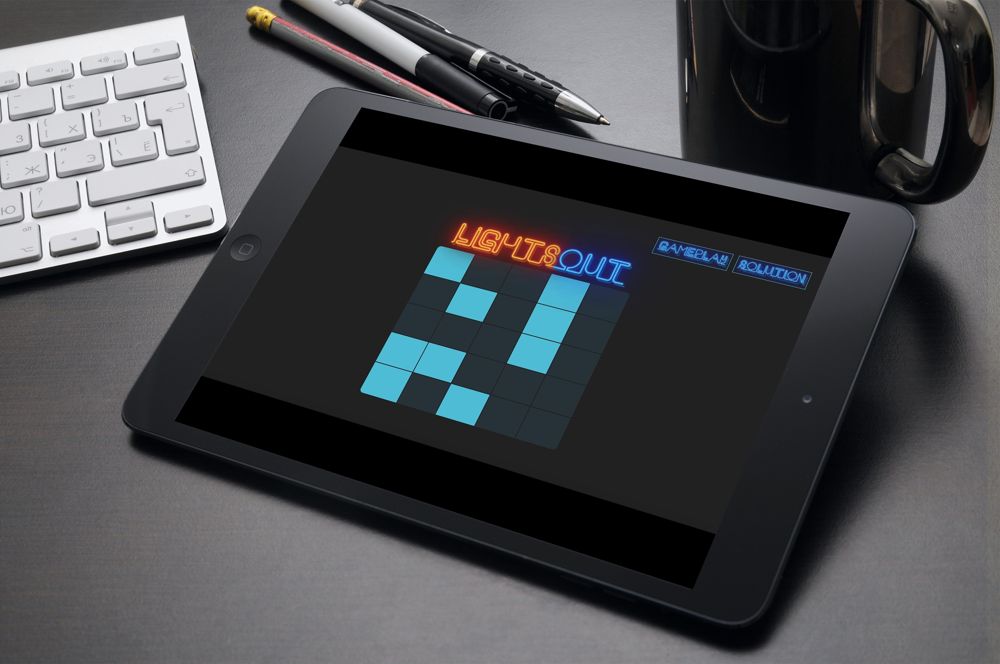

# Lights-Out-React
Lights Out is a puzzle game released by Tiger Electronics in 1995. The game consists of a 5 x 5 grid of lights that are either on or off. Pressing any light will toggle it and its adjacent lights (non-diagonal). The goal is to switch all the lights off.

